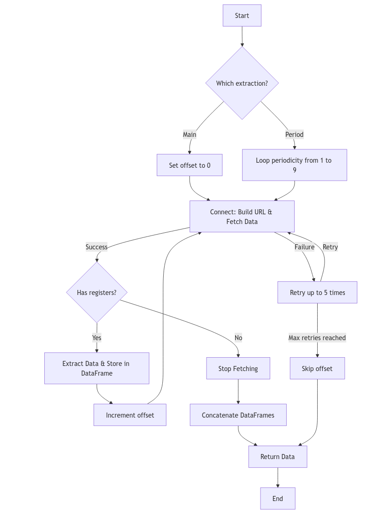
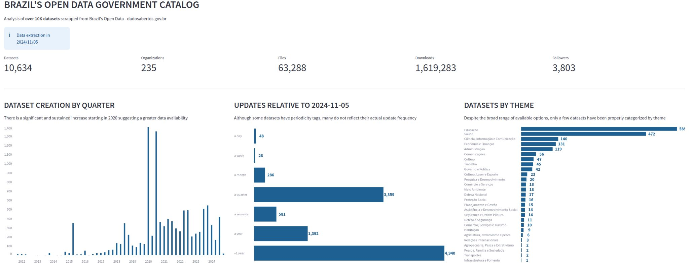

# webscrapping-meugov

Encontrar dados abertos do governo brasileiro é desafiador se não souber o que procurar com exatidão. Há milhares de conjuntos de dados catalogados, mas a maioria não corresponde aos parâmetros estabelecidos nos filtros.
As opções de periodicidade não refletem às datas de atualização, levando alguns conjuntos de dados, outrora interessantes, perderem a relevância.
O objetivo inicial era determinar quais conjuntos de dados haviam sido recentemente atualizados, e se está aderente ao parâmetro de periodicidade.
No entanto, acabei por explorar mais aspectos desse conjuntos de dados e criei um dashboard no streamlit: https://datagovdatasets.streamlit.app/

### Estrutura Crawler:

## RESULTADO STREAMLIT

